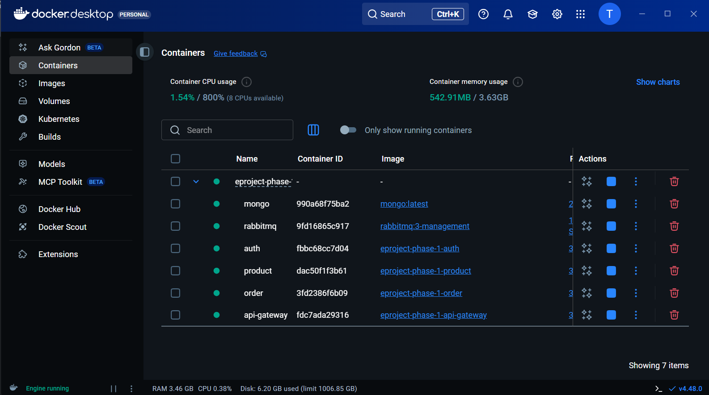
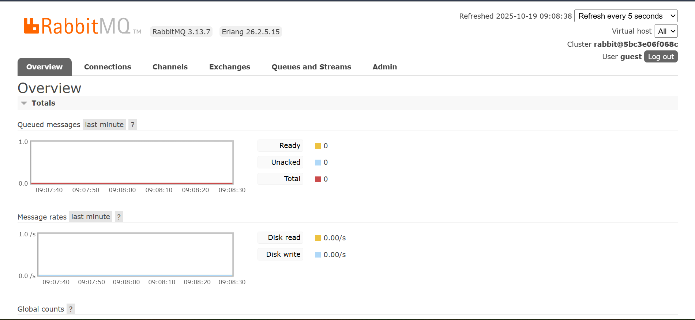
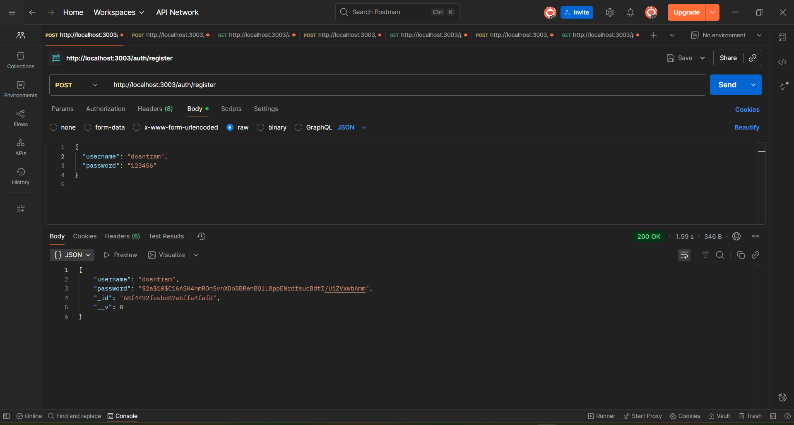
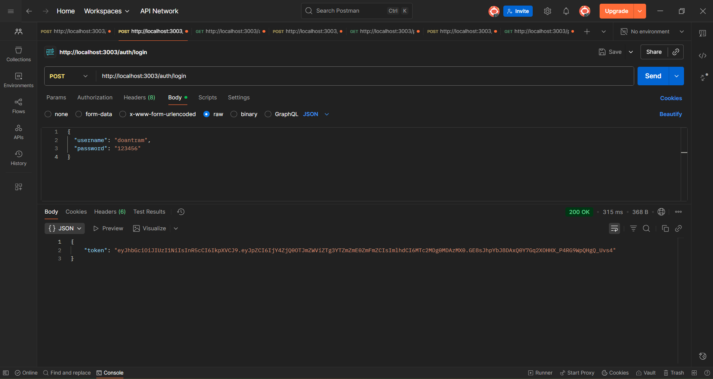
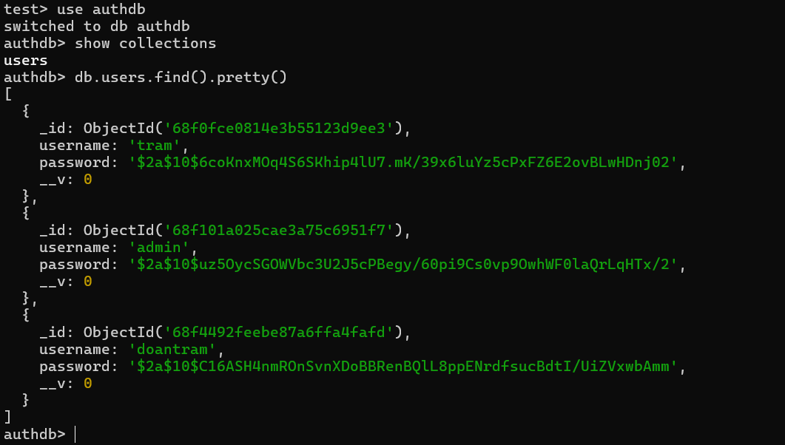
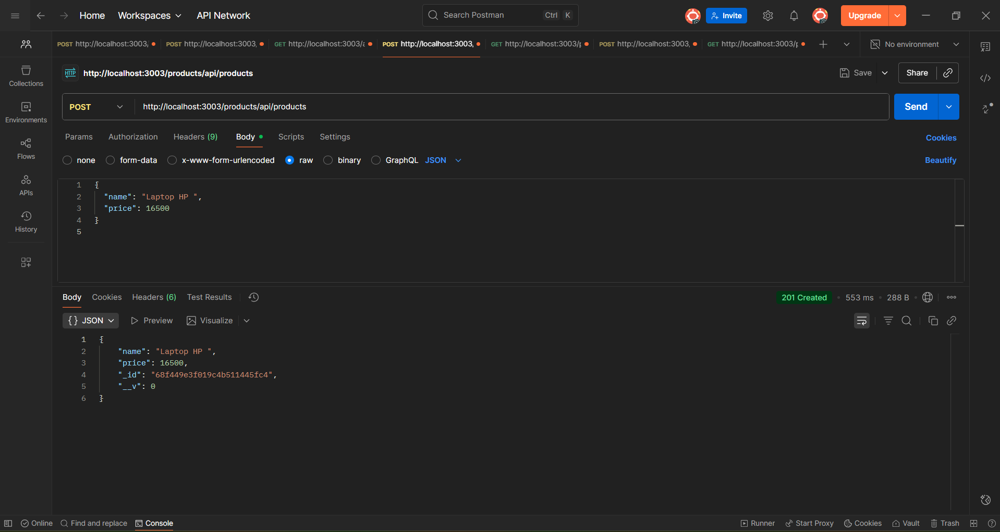
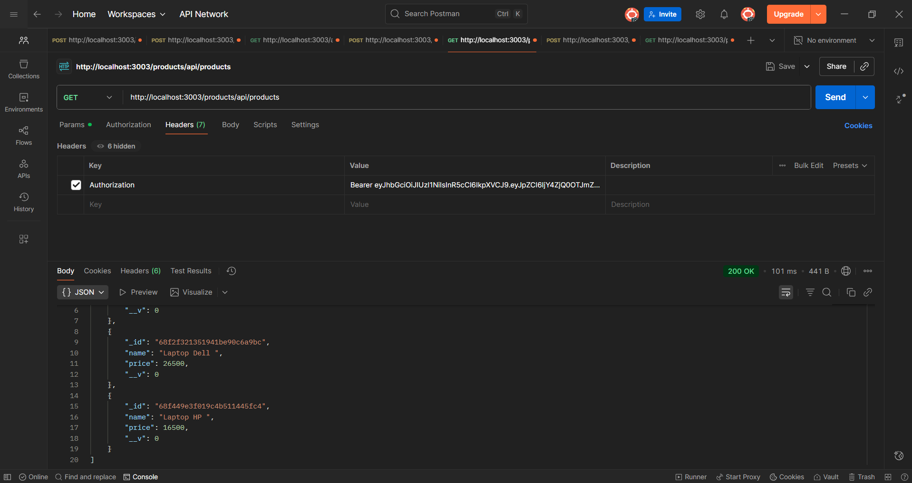
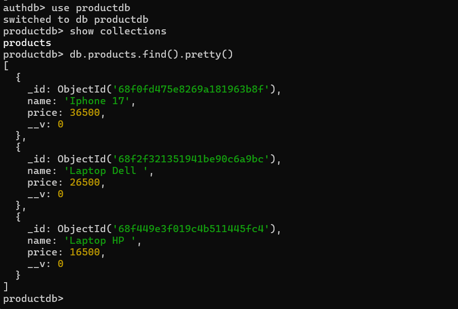
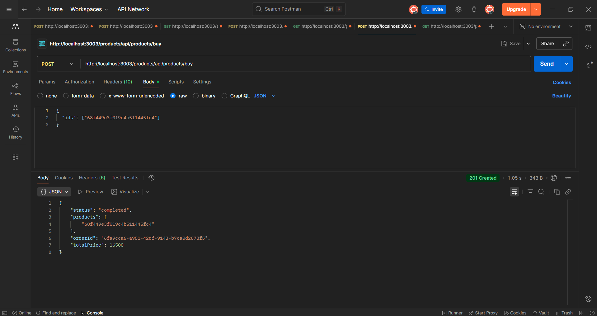
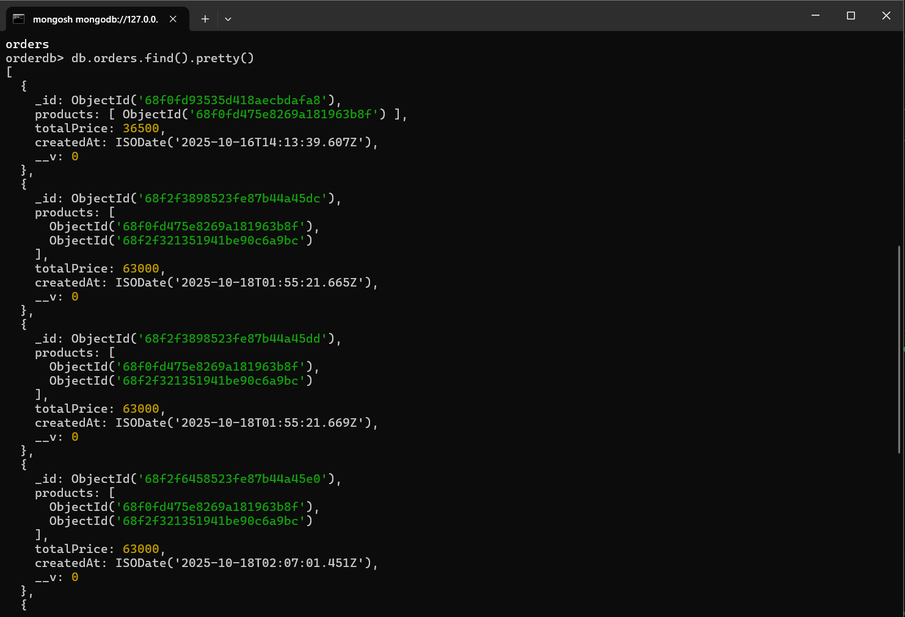

Dự án Eproject-phase-1 sử dụng **kiến trúc microservices**.  
Mỗi dịch vụ được đóng gói trong **Docker container riêng biệt**, giao tiếp với nhau qua **RabbitMQ** và lưu trữ dữ liệu trong **MongoDB**.
1. Sau khi build dự án lên docker thì chạy dự án bằng lệnh docker-compose up -d -> các container được khởi chạy

- Rabbit được khởi chảy với url: http://localhost:15672/#/

2.Test hệ thống bằng postman
- Register thành công

-Login thành công, sẽ sinh ra 1 token

-Lấy tocken để xem hồ sơ dashboad

-Dữ liệu mongo của auth

- Tạo product

-Xem danh sách product

-Dữ liệu Mongo của products

-Tạo order

-Dữ liệu Mongo của order

